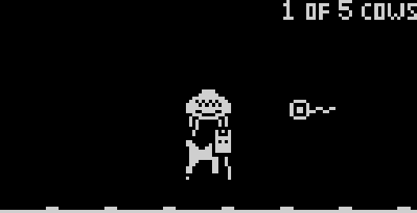

# Beam 'Em Up

a Arduboy game developed by Ben Combee

Released under Apache 2.0 license

* Arduboy2 library from https://github.com/MLXXXp/Arduboy2
* FixedPoint library from https://github.com/Pharap/FixedPointsArduino/
* ArduboyTones library from https://github.com/MLXXXp/ArduboyTones

This game is based on an idea that I've had for a very long time.  Back in the late 90's, I'd wanted
to make a screensaver for my Windows 98 machine that involved saucers going around and beaming up cows
from a pastoral landscape.  I never wrote it, but when I got my first Arduboy and saw the game jam,
this came back to me.  I was also inspired by the Atari 2600 game "Cosmic Ark", which featured beaming of
critters, but didn't have much physics.  I originally wanted the cows to splat if dropped from the top
of the screen, but I think the subtle bouncing is more friendly to the player.

Discussion of the game is at <a href="https://community.arduboy.com/t/beam-em-up-game-jam-5/9200/10">this Arduboy Community thread.</a>

<a href="https://felipemanga.github.io/ProjectABE/?url=https://github.com/unwiredben/arduboy-beamemup/raw/master/BeamEmUp/BeamEmUp.hex">Play it in your browser using ProjectABE!</a>